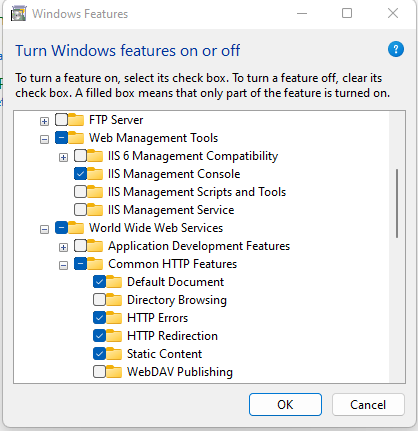
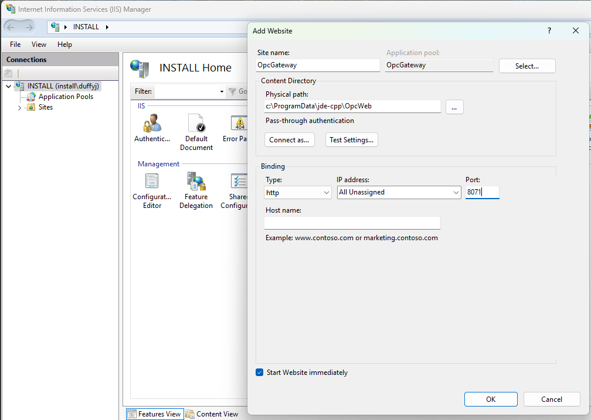
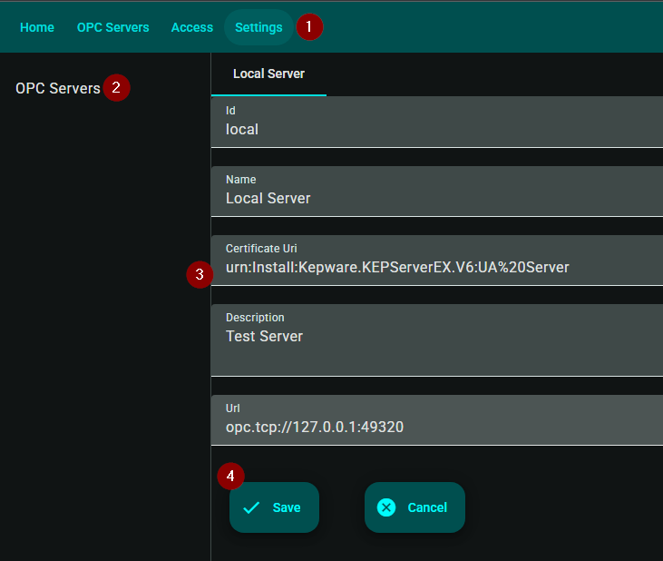
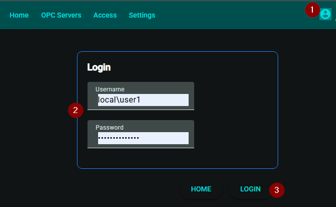
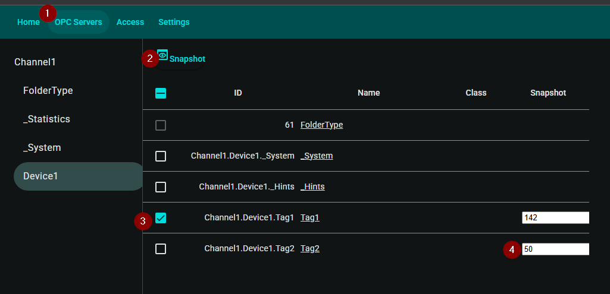

# OpcGateway

Rest/Websocket Application on top of [open62541.org](https://www.open62541.org/).

## Installation
### Prerequisites
1) [Microsoft Sql Server](https://www.microsoft.com/en-us/sql-server/sql-server-downloads).

### Steps
1) Execute OpcGateway.exe installation.
2) Setup databases, services, from administrator powershell run:
    ```
    . "$([Environment]::GetFolderPath("CommonDesktopDirectory"))/JdeSetup.ps1"
    ```
3) IIS

  a.  Features:  

  b.  Settings:  

4) To uninstall, from administrator powershell run:
    ```
    . "$([Environment]::GetFolderPath("CommonDesktopDirectory"))/JdeUninstall.ps1"
    ```
    You will need to manually delete the databases, or uncomment the related lines in JdeUninstall.ps1.

## Running
1) Start Services
```
    net start Jde.AppServer
    net start Jde.OpcGateway
```
2) Browse to http://127.0.0.1:8071.
3) Setup Opc Server.

   1) Click Settings.
   2) Opc Servers.
   3) Enter Opc Server information.
   4) Save.
4) Log in

   1) [Id specified setting up the opc server]\\[Opc User Name]
   2) Password to Opc Server.

5) Browsing/Reading/Streaming/Writing.

   1) Click Opc Servers and browse to a node.
      1) Initially you may need to trust the client certificate on OpcServer.
   3) Click Snapshot to refresh values.
   4) Click checkbox next to a node to stream values.
   5) Enter new node value to write.
